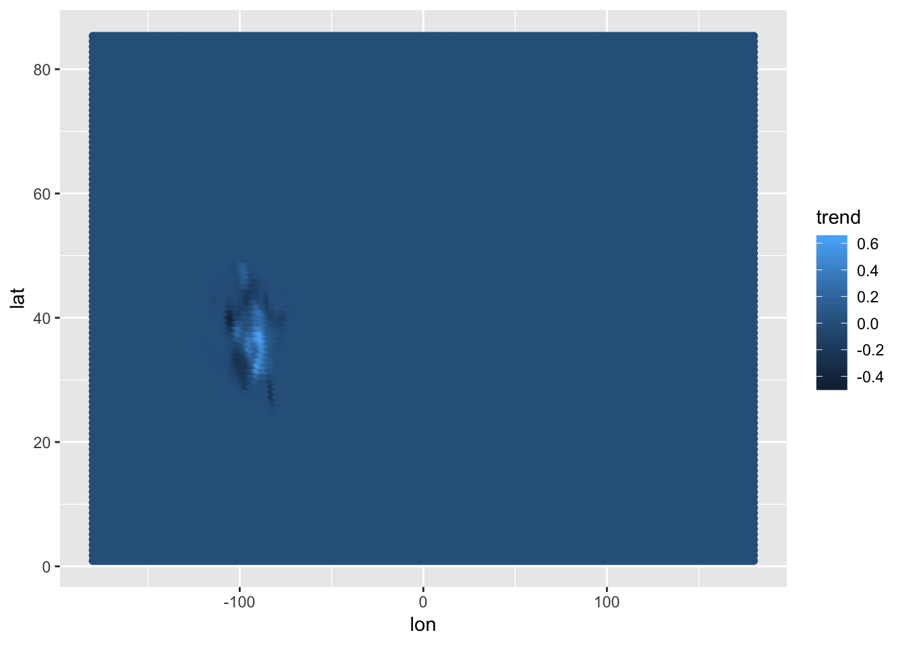
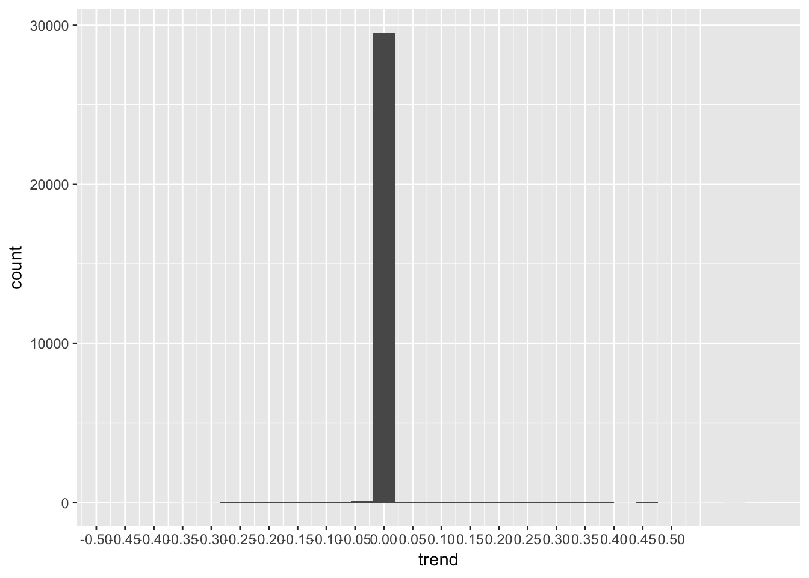
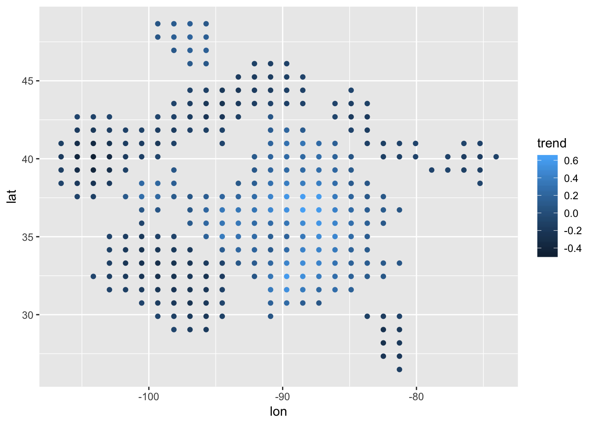
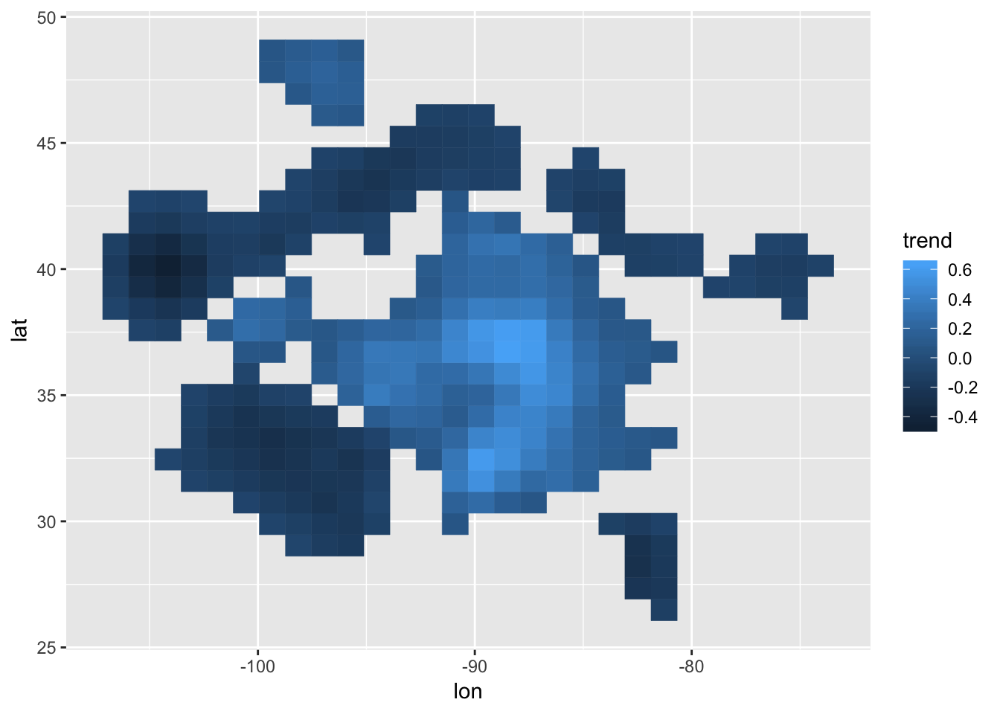
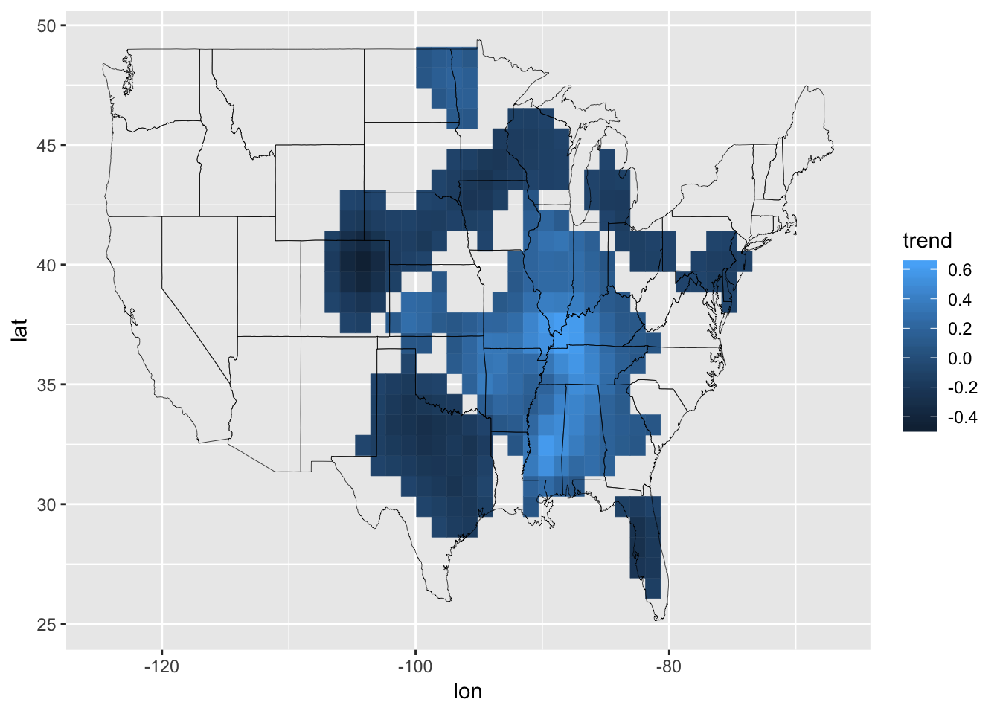
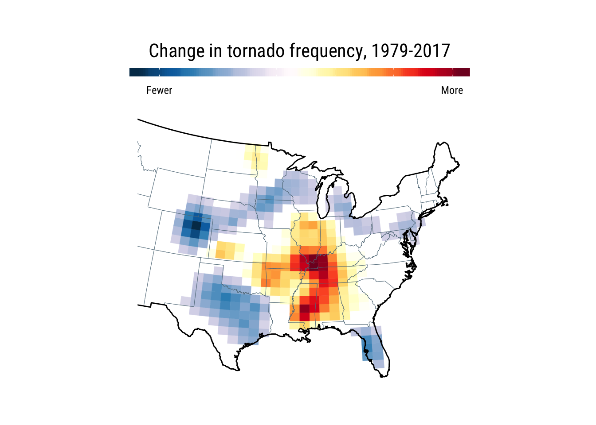

tornado
================

``` r
library(here)
library(hrbrthemes) # not 100% necessary
library(tidyverse)  # data wrangling & ggplot2
```

``` r
tibble(
  lat = scan(here("data/lats.txt")),
  lon = scan(here("data/lons.txt")),
  trend = scan(here("data/trends.txt"))
) -> tornado
```

``` r
tornado
## # A tibble: 30,000 x 3
##      lat   lon trend
##    <dbl> <dbl> <dbl>
##  1 0.897 -180.     0
##  2 0.897 -179.     0
##  3 0.897 -178.     0
##  4 0.897 -176.     0
##  5 0.897 -175.     0
##  6 0.897 -174.     0
##  7 0.897 -173.     0
##  8 0.897 -172.     0
##  9 0.897 -170.     0
## 10 0.897 -169.     0
## # … with 29,990 more rows

summary(tornado)
##       lat               lon                 trend           
##  Min.   : 0.8973   Min.   :-179.99808   Min.   :-0.4733610  
##  1st Qu.:22.0063   1st Qu.: -90.00066   1st Qu.: 0.0000000  
##  Median :43.1154   Median :  -0.00323   Median : 0.0000000  
##  Mean   :43.1154   Mean   :  -0.00323   Mean   : 0.0002756  
##  3rd Qu.:64.2245   3rd Qu.:  89.99419   3rd Qu.: 0.0000000  
##  Max.   :85.3335   Max.   : 179.99161   Max.   : 0.6314569
```

### Grid overview

``` r
ggplot(tornado, aes(lon, lat)) +
  geom_point(aes(color = trend))
```



### Trend overview

``` r
ggplot(tornado, aes(trend)) +
  geom_histogram() +
  scale_x_continuous(breaks = seq(-0.5, 0.5, 0.05))
```



``` r

maps::map("state", ".", exact = FALSE, plot = FALSE, fill = TRUE) %>%
  fortify(map_obj) %>%
  as_tibble() -> state_map

xlim <- range(state_map$long)
ylim <- range(state_map$lat)

filter(
  tornado,
  between(lon, -107, xlim[2]), between(lat, ylim[1], ylim[2]), # -107 gets us ~left-edge of TX
  ((trend < -0.07) | (trend > 0.07)) # approximates observable notebook selection range
) -> tornado
```

### Grid overview \#2

``` r
ggplot(tornado, aes(lon, lat)) +
  geom_point(aes(color = trend))
```



### Grid overview \#3

``` r
ggplot(tornado, aes(lon, lat)) +
  geom_tile(aes(fill = trend, color = trend))
```



### Map

``` r
ggplot() +
  geom_tile(
    data = tornado,
    aes(lon, lat, fill = trend, color = trend)
  ) +
  geom_map(
    data = state_map, map = state_map,
    aes(long, lat, map_id = region),
    color = "black", size = 0.125, fill = NA
  )
```



### Map (final)

``` r
c(
  "#023858", "#045a8d", "#0570b0", "#3690c0", "#74a9cf",
  "#a6bddb", "#d0d1e6", "#ece7f2", "#fff7fb", "#ffffff",
  "#ffffcc", "#ffeda0", "#fed976", "#feb24c", "#fd8d3c",
  "#fc4e2a", "#e31a1c", "#bd0026", "#800026"
) -> grad_cols

ggplot() +
  geom_tile(
    data = tornado,
    aes(lon, lat, fill = trend, color = trend)
  ) +
  geom_map(
    data = state_map, map = state_map,
    aes(long, lat, map_id = region),
    color = ft_cols$slate, size = 0.125, fill = NA
  ) +
  borders("usa", colour = "black", size = 0.5) +
  scale_colour_gradientn(
    colours = grad_cols,
    labels = c("Fewer", rep("", 4), "More"),
    name = "Change in tornado frequency, 1979-2017"
  ) +
  scale_fill_gradientn(
    colours = grad_cols,
    labels = c("Fewer", rep("", 4), "More"),
    name = "Change in tornado frequency, 1979-2017"
  ) +
  coord_map(
    projection = "polyconic",
    xlim = scales::expand_range(range(tornado$lon), add = 2),
    ylim = scales::expand_range(range(tornado$lat), add = 2)
  ) +
  guides(
    colour = guide_colourbar(
      title.position = "top", title.hjust = 0.5
    ),
    fill = guide_colourbar(
      title.position = "top", title.hjust = 0.5
    )
  ) +
  labs(
    x = NULL, y = NULL
  ) +
  theme_ipsum_rc(grid="") +
  theme(axis.text = element_blank()) +
  theme(legend.position = "top") +
  theme(legend.title = element_text(size = 16, hjust = 0.5)) +
  theme(legend.key.width = unit(4, "lines")) +
  theme(legend.key.height = unit(0.5, "lines"))
```


